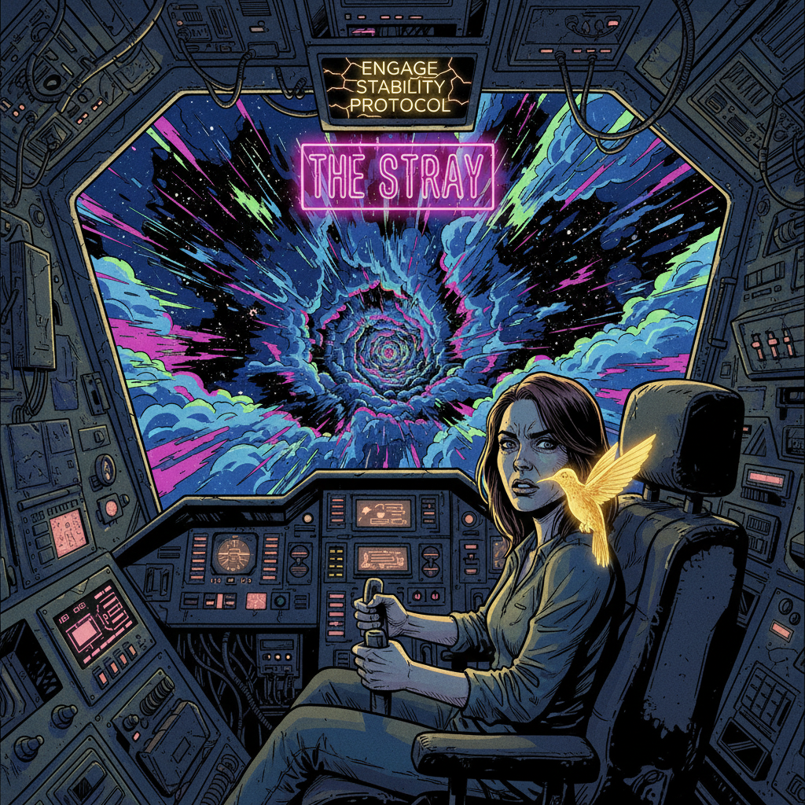
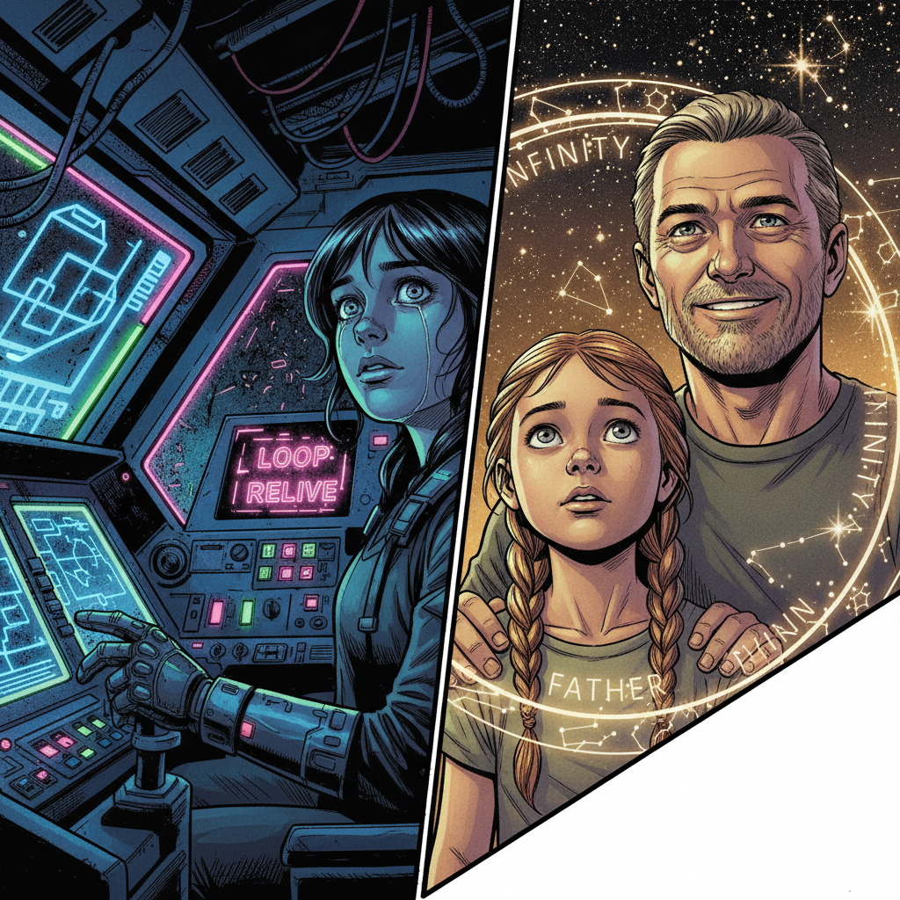
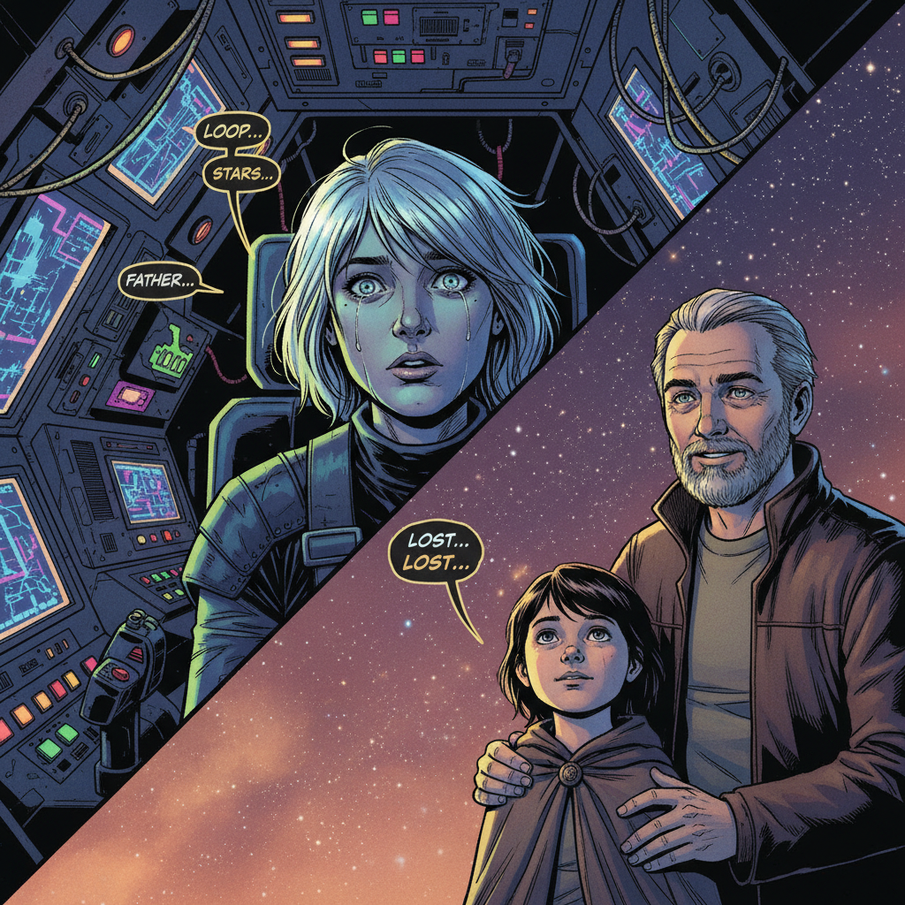
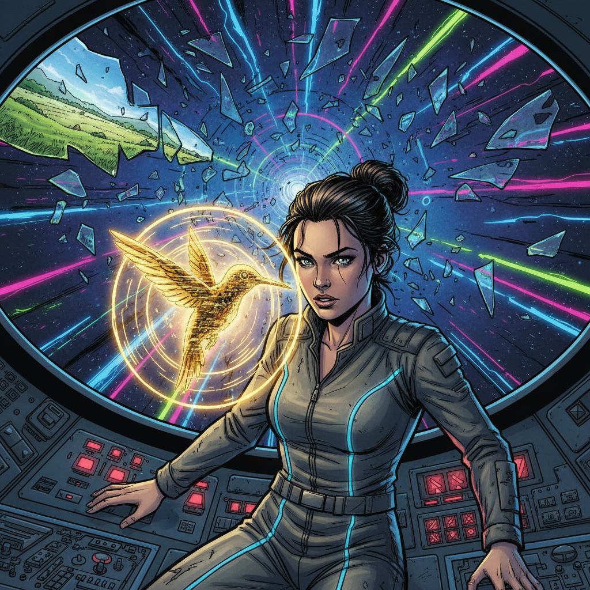
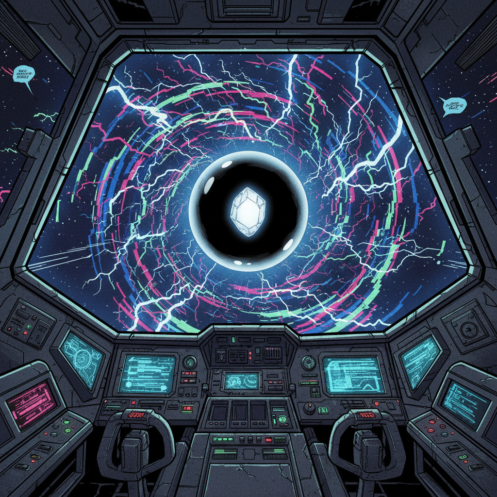
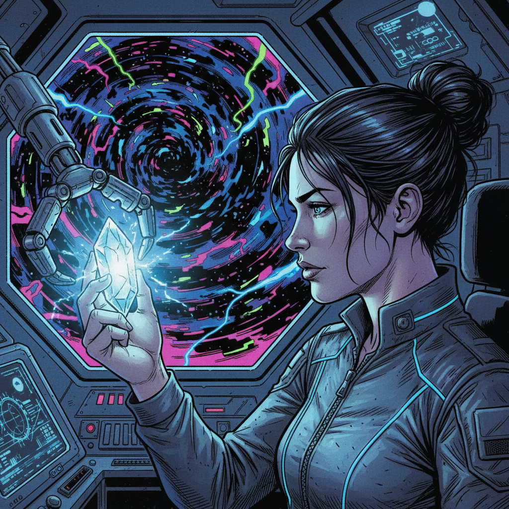

# Comic Strip Layout

## Panel 1
Description: WIDE SHOT. The cramped cockpit of the starship, 'The Stray.' Lyra grips the controls, her knuckles white. Her face is illuminated by the chaotic view outside the main viewport and the glow of myriad control screens. Outside, a 'star corridor' twists like a psychedelic tunnel of nebulae, fractured light, and distorted starfields. Nimbus, a golden hummingbird of light, hovers near Lyra’s shoulder, its form stable for now.

Dialogue: **Nimbus:** "Corridor integrity is failing, Lyra. We are approaching the nexus. Probability of non-linear temporal events: 87 percent."
**Lyra:** "Just means we're close, Nim. Keep the scanners hot. We don't get a second chance at this."

## Panel 2
Description: CLOSE-UP on Lyra’s face, her eyes wide with alarm. A 'time echo' hits. A translucent, ghostly after-image of her own hand reaches for a control switch a split second before her real hand does. The entire cockpit flickers, showing a brief, overlapping image of the same scene a moment in the future. Nimbus’s form glitches, breaking into pixelated squares for a moment.

Dialogue: **Nimbus:** "Temporal echo detected! Baseline reality is... unstable. Be careful what you touch."
**Lyra:** "Noted. Just another Tuesday in the cosmic funhouse."

## Panel 3
Description: A disorienting panel, split diagonally. On the left, the neon-drenched, chaotic reality of the cockpit. On the right, a soft-focus, warm-toned memory: A younger Lyra is looking up at a starry night sky (pre-flares) with an older man, her father, his hand on her shoulder. The memory is a 'loop,' a trap. In the cockpit half, Lyra’s eyes are unfocused, a single tear tracing a path down her cheek. She's reliving a moment of loss.

Dialogue: **Father (Memory):** "See that one, Lyra? Andromeda. Even from millions of light-years away, its light reaches us..."
**Lyra (Whispered):** "...it always finds a way home."

## Panel 4
Description: MEDIUM SHOT. Nimbus zips directly in front of Lyra's face, pulsing with a brilliant, insistent golden light, trying to break her out of the memory loop. The memory in the background shatters like glass. Outside the viewport, the ship is tilting at an impossible angle as it's caught in a gravity glitch—the star corridor is now sideways. Alarms flash silently on the console.

Dialogue: **Nimbus (Urgent):** "Lyra! Your biometric readings are critical! You must disengage the memory loop! The gravity well is pulling us apart!"
**Lyra:** "Gah! I'm here! I'm here! Hold on!"

## Panel 5
Description: POV SHOT from Lyra's perspective, looking through the main viewport. They have cleared the gravity well. Dead ahead, suspended in a bubble of serene, stable space amidst the swirling chaos, is the objective: The Andromeda Shard. It is a fist-sized, crystalline object that pulses with a pure, gentle, white light—a stark contrast to the aggressive neon colors of the corridor. It is beautiful and heartbreakingly lonely.

Dialogue: **Nimbus:** "By the All-Code... There it is. The last light."
**Lyra:** "Incredible..."

## Panel 6
Description: CLOSE-UP SHOT from the side. The ship's robotic manipulator arm has retrieved the shard and brought it into the cockpit. Lyra has taken off her glove and is reaching out, her fingers inches from the glowing crystal. The shard's pure light illuminates her face, washing out the harsh neon glow. For the first time, there is a look of genuine, fragile hope in her eyes. Behind her, out the viewport, the star corridor is violently collapsing into a vortex of blackness.

Dialogue: **Nimbus:** "We have it, Lyra. But the corridor is gone. There's no turning back."
**Lyra:** "We were never turning back, Nimbus. We were always going forward. Now... let's give them some light."