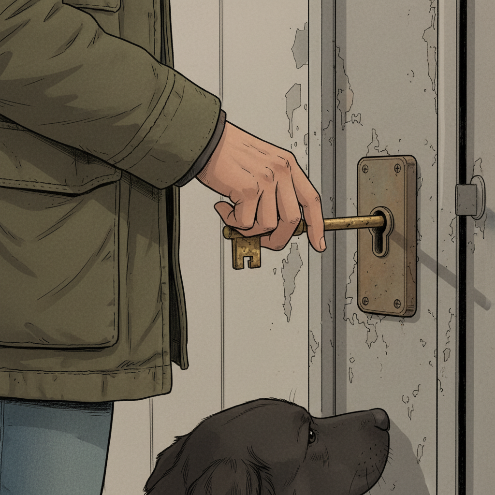
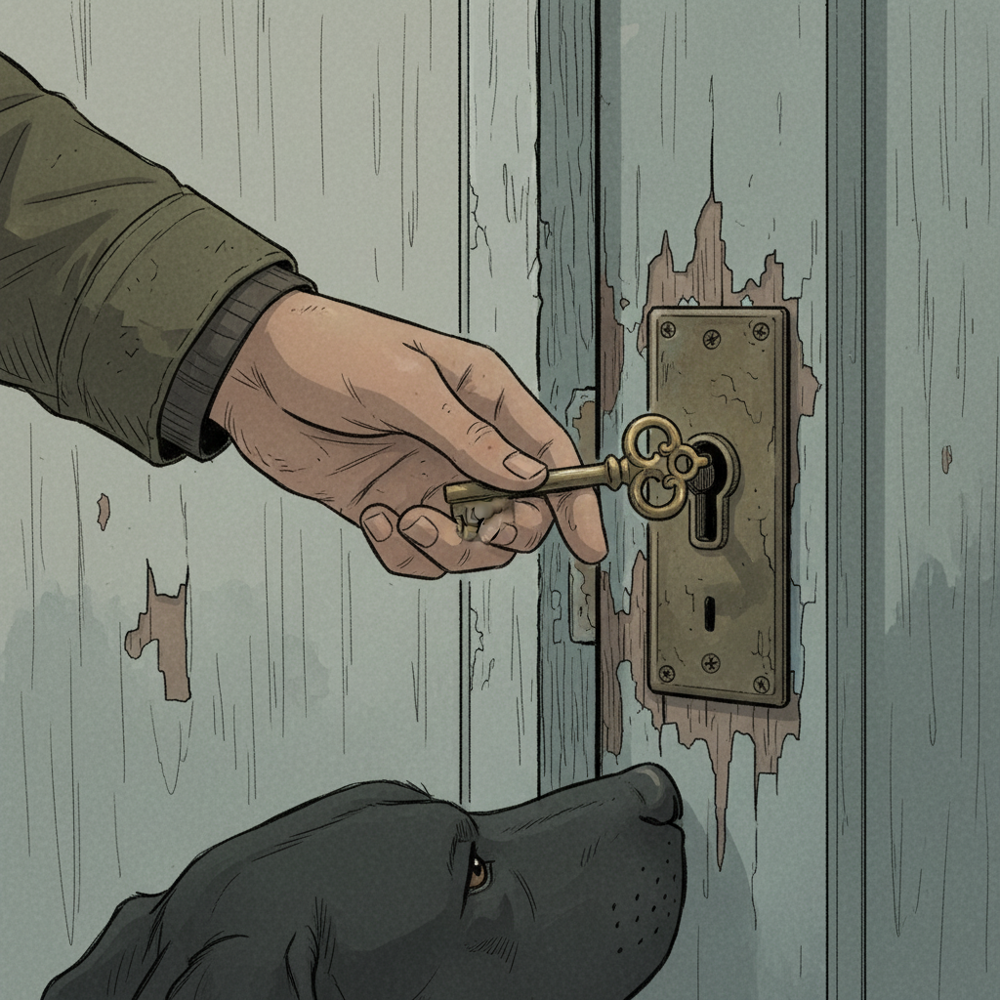
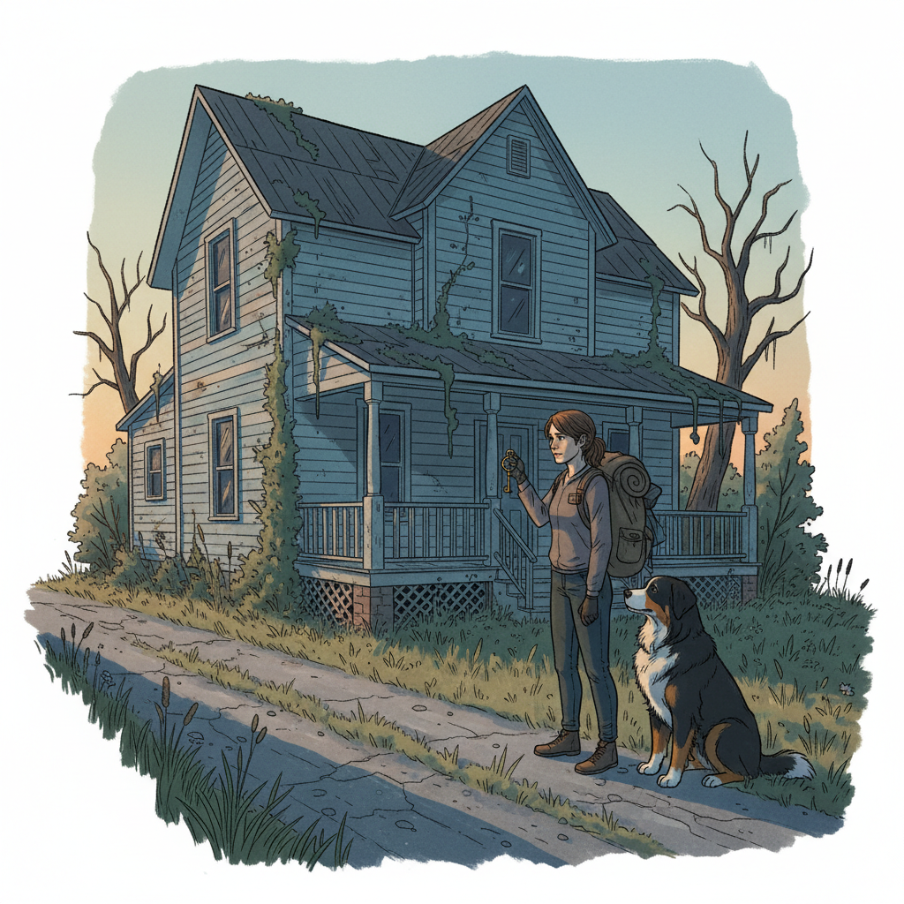
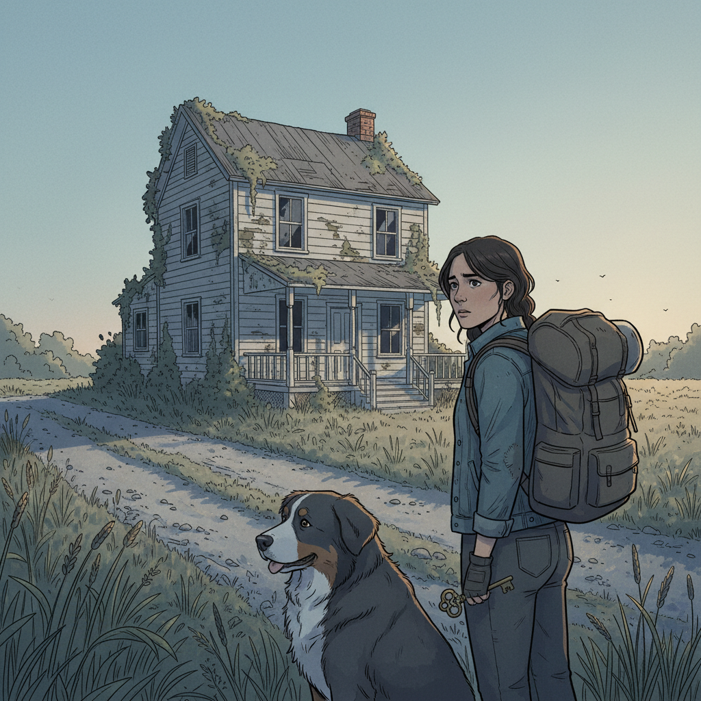

# Comic Strip Layout

## Panel 1

**Description:** An eye-level shot of a slightly worn apartment door (No. 4B). Zara is in the foreground, keys in hand, turning the lock. She's looking back over her shoulder at Leo, who is just out of frame, with a bright, slightly nervous smile. The hallway is dimly lit with cool, blueish light from a high window. The sound effect "CLICK" is written in small, clean letters near the lock.

**Dialogue:** Zara: "Okay, prepare yourself. It's not a palace, but I call it 'organized chaos.'"

---

## Panel 2

**Description:** Interior shot from behind Zara's shoulder as she pushes the door open. The apartment is dark, with only the faint blue light from the hallway spilling in, creating long shadows. We can see the vague shapes of a sofa and a coffee table. Leo stands in the doorway behind her, his silhouette framed by the hall light.

**Dialogue:** Zara: "Hang on, let me get the lights… The switch is a bit of a diva."

---

## Panel 3

**Description:** The lights are on. Wide shot of the living room. It's cozy and lived-in, but definitely a bit messy. A stack of books teeters on the coffee table, a forgotten mug sits next to it, and a large, half-unpacked cardboard box labeled "ART SUPPLIES" is in the middle of the floor. In the background, on a windowsill, a small succulent is looking droopy and sad.

**Dialogue:** Zara: (A small, slightly strained speech bubble) "Ta-daaa... See? Chaos."

---

## Panel 4

**Description:** A split panel showing two close-ups. Top Half: Close-up on Zara's face. She's biting her lower lip, her eyes wide with a look of "Oh gosh, I forgot about all this." She looks embarrassed but is trying to play it off. Bottom Half: Close-up on Leo's face. He's not looking at the mess. He's looking at Zara, and a gentle, warm smile is spreading across his face. He looks completely unfazed and charmed.

**Dialogue:** Leo: (From the bottom half of the panel) "I like it. It looks like someone actually lives here."

---

## Panel 5

**Description:** A medium shot. Leo has walked past Zara and the messy box. He's now standing by the windowsill, gently touching a leaf of the sad, wilting succulent. Zara is watching him from the middle of the room, her anxious expression softening into one of surprised affection. Her hands, which were nervously fiddling, are now still.

**Dialogue:** Leo: "This little guy looks thirsty."

---

## Panel 6

**Description:** A warm, intimate final panel. Leo is using the forgotten mug from the coffee table to gently water the plant. Zara has come to stand beside him, leaning her shoulder lightly against his. They are both looking at the plant, not at each other, but the feeling of connection is strong. The lamplight casts a warm, golden glow on them. The messy room is now just a soft-focus background. The feeling is peaceful and content.

**Dialogue:** Zara: (Softly, in a small, warm-colored speech bubble) "Welcome home."

---

*Generated by Visual Comic Crew - CrewAI System*
*Comic Title: "Zara Returning Home with Leo"*